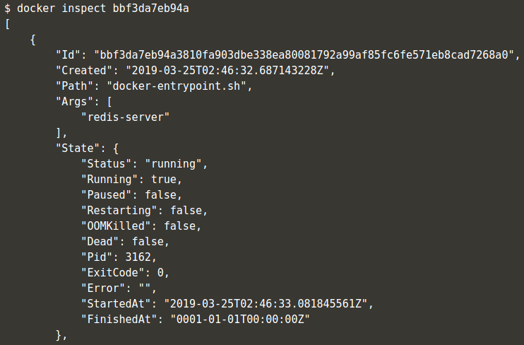

# Pertemuan Minggu-03

## Docker

> Referensi : [https://www.katacoda.com/courses/docker/deploying-first-container](https://www.katacoda.com/courses/docker/deploying-first-container)

### Step 1: Menjalankan Docker Kontainer

Docker container berjalan berdasarkan Docker Image. Docker Image ini berisi tentang semua kebutuhan untuk menjalankan sebuah proses. Ada beberapa docker image yang sudah tersedia di [Docker Registry](https://registry.hub.docker.com/) atau jalankan perintah `docker search nama-docker-image`. Contoh kasus docker image redis. Perintah `docker search <name>` ini berfungsi untuk mencari apakah **docker image** yang diinginkan sudah tersedia di [Docker Registry](https://registry.hub.docker.com/) atau belum.


Dari perintah `docker search redis` akan menghasilkan daftar docker image yang sudah terdaftar di dalam Docker Registry dan bisa digunakan untuk kebutuhan development. Dari daftar yang muncul Docker Image Redis terdaftar dengan nama `redis`. Untuk menjalankan Docker Image Redis di local Docker CLI terdapat perintah yang akan menjalankan Docker Container berdasarkan nama dari Docker Image, perintah nya adalah `docker run <options> <image-name>` [Doc](https://docs.docker.com/engine/reference/commandline/run/).

Secara default docker akan menjalankan kontainer di foreground. Untuk menjalankan container secara background gunakan opsi `-d`. Perintahnya seperti berikut : `docker run -d redis`


Perintah di atas akan menghasilkan output berupa container ID seperti yang ada di dalam gambar diatas. Secara default docker akan menjalankan container (docker image) versi terakhir. Jika ingin menjalankan docker image versi tertentu sertakan versi dari docker image yang ada, dengan perintah `docker run -d redis:3.2`. Berdasarkan perintah ini, Docker CLI akan me-download docker image redis versi 3.2 jika image yang dimaksud belum ada di local.

### Step 2 : Mencari kontainer yang berjalan

Kontainer yang sudah dijalankan menggunakan opsi `-d` akan berjalan di background, untuk memastikan kontainer yang berjalan sesuai dengan yang diinginkan gunakan perintah `docker ps`, perintah ini digunakan untuk menampilkan daftar semua kontainer yang berjalan di local komputer. Dari perintah ini kita bisa mendapatkan **Container ID** dan **Nama Container** yang sedang berjalan, seperti pada gambar dibawah ini.


Untuk mendapatkan informasi yang detail tentang kontainer yang sudah berjalan, gunakan perintah `docker inspect <friendly-name|container-id>` perintah ini akan menampilkan informasi secara detail, seperti IP Address dari container, status container dan lain-lain.



Perintah `docker logs <friendly-name|container-id>` akan menampilkan log pesan dari kontainer.


### Step 3 : Accessing Redis

Sebuah docker container yang berjalan tidak akan bisa di akses oleh host computer jika port dari container tidak di expose. Perintah untuk me-expose port dari docker container supaya bisa di akses dari host computer adalah `docker run -d --name redisHostPort -p 6379:6379 redis:lates`.


Perintah di atas akan menjalankan kontainer redis versi terupdate dengan nama `redisHostPort`, dan expose port redis (port default) container melalui host port 6379. Sehingga ketika host akses port 6379 sama saja melakukan akses terhadap container redis yang dijalankan. Opsi `-name redisHostPort` disini digunakan untuk identifikasi nama container yang berjalan, untuk mempermudah mengenali kontainer.

### Step 4 : Accessing Redis

Permasalahan ketika menjalankan docker pada port yang fixed adalah kita tidak bisa menjalankan beberapa instance secara bersamaan. Untuk menjalankan beberapa instance secara bersamaan jalankan perintah `docker run -d --name redisDynamic -p 6379 redis:latest` abaikan host port, dengan cara ini docker akan me-assign host port secara otomatis, akan mencarai port yang tersedia untuk mem-binding port 6379 milik container redis dengan port yang tersedia milik host.


Untuk mengetahui container berjalan di port mana gunakan perintah `docker port redisDynamic 6379`


Selain menggunakan perintah di atas, `docker ps` juga bisa digunakan untuk melihat port mapping dari contaniner yang sedang berjalan.


### Step 5 : Persisting Data

Data yang ada di dalam container docker akan ikut hilang jika container yang ada dihapus atau container di buat baru. Untuk menghindari kehilangan data, docker CLI ada opsi untuk binding volumes yaitu mount volume local ke dalam volume container dengan menyertakan opsi `-v <host-dir>:<container-dir>`. Dengan opsi ini semua yang ada di **mounted-volume** akan sama dengan yang ada di dalam container, jika container di hapus atau di buat ulang, data akan tetap tersimpan di volume local.


### Step 6 : Running A Container In The Foreground

Pada langkah-langkah sebelumnya, perintah docker yang dijalankan menyertakan opsi `-d` yang mana container berjalan di background, jika ingin menjalankan container secara foreground hilangkan opsi `-d`, dengan begitu kita bisa berinteraksi dengan container. Contoh menggunakan perintah `ps` milik OS Ubuntu, untuk menampilkan proses yang berjalan di dalam container ubuntu.


Untuk bisa berintaksi dengan bash shell milik ubuntu sertakan opsi `-it`, dengan opsi ini container akan berjalan dan kita bisa meng-akses bash shell `docker run -it ubuntu bash`


## Docker - Deploy Static HTML Website as Container

> Referensi : [https://www.katacoda.com/courses/docker/create-nginx-static-web-server](https://www.katacoda.com/courses/docker/create-nginx-static-web-server)

Docker image dapat berjalan berdasarkan base image. Docker image harus menyertakan semua kebutuhan yang dibutuhkan oleh aplikasi yang ingin dijalankan menggunakan environment docker. Base image image yang berisi tentang instruksi, perintah-perintah di sebut dan diberi nama dengan Dockerfile, docker CLI akan mengidentifikasi file Dockerfile. Contoh kasus membuat web statis menggunakan http server `nginx`

### Step 1 : Create `Dockerfile`

Buat sebuah file dengan nama `Dockerfile` dan isi dengan content seperti berikut:

```markdown
FROM nginx:alpine
COPY . /usr/share/nginx/html
```

Pada baris pertama mendefinisikan bahwa kita akan menggunakan base image `nginx:alpine`, dan pada baris kedua perintah untuk meng-copy semua isi directory ke directory container `/usr/share/nginx/html` yaitu directory default nginx untuk menampung semua file html.

### Step 2 : Build Docker Image

Untuk menjalankan app (web static menggunakan nginx) yang perlu dilakukan adalah mem-build Dockerfile menjadi docker-image yang bisa dijalankan oleh Docker CLI dengan perintah `docker build -t <repository-name> .`


opsi `-t webserver-image:v1` digunakan untuk memberikan nama pada docker image dengan `webserver-image` dan tag docker image dengan v1. Untuk memastikan image yang ada di dalam host komputer jalankan perintah `docker images`


### Step 3 : Run

Docker image yang sudah selesai di build, dapat dijalankan dengan perintah `docker run -d -p 80:80 webserver-image:v1`.


Setelah docker image sukses dijalankan, webserver akan bisa diakses melalui browser dengan mengakses hostname port 80. Untuk mengetest apakah docker container berjalan gunakan perintah `curl docker`


Jika diakses melalui browser akan menghasilkan output seperti gambar dibawah.


> Structur file


## Docker - Building Container Images

> Referensi : [https://www.katacoda.com/courses/docker/2](https://www.katacoda.com/courses/docker/2)

Pada skenario pertama, terdapat langkah-langkah untuk menjalankan container berdasarkan docker image yang sudah ada di Docker Registry. Pada skenario ini, kita akan membuat sebuah docker image yang akan menjalankan aplikasi HTML Statis menggunakan Nginx. Docker machine yang berjalan di sebut docker. Jadi jika ingin meng-akses setiap service yang berjalan menggunakan docker, akses melalui browser dan arahkan alamat ke docker bukan ke localhost atau 0.0.0.0.

### Docker Images

Docker images di build berdasarkan 1 buah file yang bernama Dockerfile. Dockerfile ini yang mendefinisikan semua langkah-langkah yang dibutuhkan untuk membuat sebuah Docker images yang berisi konfigurasi aplikasi dan semua aset yang dibutuhkan untuk sebuah aplikasi bisa berjalan sebagai container. Docker image ini bisa dibilang berisi semua komponen, mulai dari OS yang dipakai, Dependencies dan konfigurasi yang dibutuhkan untuk sebuah aplikasi bisa berjalan.

Dengan docker image yang menampung semua kebutuhan aplikasi membuat aplikasi menggunakan docker image ini bisa berjalan di semua environment tanpa harus melakukan penyesuaian konfigurasi aplikasi.

Untuk menjalankan docker container yang berisi Aplikasi HTML Statis menggunakan server Nginx hal-hal yang harus di lakukan adalah:

#### Step 1 : Base image

Semua docker image di mulai dari base image. Pada file `Dockerfile` gunakan syntax `FROM <image-name>:<tag>` untuk menggunakan base image yang suda ada di Docker Registery.

Buat sebuah file `Dockerfile` dan isi dengan

```markdown
FROM nginx:1.11-alpine
```

Base image yang akan kita gunakan adalah server Nginx versi 1.11 dan menggunakan OS alpine. Dengan mendefinisikan tag pada base image yang digunakan akan menghindarkan kita untuk melakukan penyesuaian konfigurasi. Jika tag tidak didefinisikan, base image akan mengambil tag `latest`, dan kemungkinan terdapat perbedaan konfigurasi untuk Nginx bisa berjalan.

#### Step 2 : Running Commands

Command utama yang dibutuhkan untuk menjalankan docker container menggunakan base image adalah `COPY` dan `RUN`. Command-command ini digunakan untuk konfigurasi image sesuai yang kita inginkan.

`RUN <command>` memungkinkan kita untuk menjalankan perintah-perintah yang ada di os linux, contohnya menjalankan perintah update package, install package ketika proses build image dijalankan. Yang perlu diperhatikan adalah hasil perintah-perintah ini akan tetap ada didalam image yang kita buat, jadi jangan jalankan perintah-perintah yang tidak penting yang menimbulkan ukuran image membengkak, semakin kecil image yang dibuat semakin bagus.

`COPY <src> <dest>` Perintah yang digunakan docker untuk menyalin file/directory dari komputer local (host) ke dalam docker images. Gunakan perintah ini untuk memasukkan `source code` dan `asets` yang dibutuhkan untuk sebuah aplikasi bisa berjalan.

Buat sebuah file `index.html` yang berisi syntax simple:

```html
<h1>Hello world</h1>
```

Update `Dockerfile` dan tambahkan perintah `COPY` untuk memasukkan file `index.html` ke dalam image.

```markdown
FROM nginx:1.11-alpine

COPY index.html /usr/share/nginx/html
```

Perintah diatas akan memasukkan file `index.html` ke dalam folder `/usr/share/nginx/html` adalah directory pertama yang akan di akses oleh nginx ketika server ini dijalankan.

#### Exposing ports

Port ini dibutuhkan supaya container yang berjalan bisa diakses melalui komputer (host) yang sedang kita gunakan. Port ini digunakan container untuk berkomunikasi.

`EXPOSE <port>` adalah perintah yang digunakan untuk memberitahu Docker port mana yang dibuka oleh container. Perinta `EXPOSE` ini tidak hanya digunakan untuk membuka 1 port tapi bisa menggunakan range port misal `EXPOSE 80`, `EXPOSE 8080`, atau `EXPOSE 7000-8000`.

Update `Dockerfile` tambahkan perintah `EXPOSE 80`. 80 adalah port default Nginx.


#### Default Commands

Untuk mendefinisikan perintah default ketika Docker image di jalankan gunakan syntax `CMD [<command>]`. Dengan menggunakan array pada syntax `CMD` docker akan mudah menjalankan perintah dan argumen-argumen yang sudah definisikan. Contoh: `["cmd", "-a", "arga value", "-b", "argb-value"]`, docker akan menggabungkan menjadi `cmd -a "arga value" -b argb-value`, dan perintah ini yang akan dijalankan untuk menjalankan container.

Secara default base image NGINX adalah `nginx -g daemon off;` didalam Docker image kita tidak perlu mendefinisikan `CMD [<command>]`.

#### Building containers

Setelah selesai mendefinisikan semua perintah ke dalam `Dockerfile` langkah berikutnya adalah build Dockerfile sehingga menjadi sebuah `docker image`, dengan begitu container yang kita inginkan bisa dijalankan. Gunakan perintah `docker build -t <name> .` untuk melakukan build docker image, `-t <name>` ini sangat penting untuk mendefinisikan nama docker image yang akan kita gunakan untuk menjalankan container. Opsi-opsi yang bisa digunakan ketika build container bisa dilihat di [dokumentasi](https://docs.docker.com/engine/reference/commandline/build/).


> Build docker image dengan nama tcclanjut-web

### Launcing image

Setelah berhasil build image yang ditandai dengan `Successfully tagged tcclanjut-web:latest`, Kita bisa menjalankan container dengan perintah `docker run -d -p 80:80 <image-id|friendly-tag-name>`. Untuk memastika docker-image sudah ada gunakan perintah `docker images`


Gunakan perintah `curl` dari komputer host untuk memastikan file html sukes di jalankan pada server nginx didalam container yang kita jalankan.


