# Pertemuan Minggu-04

## Docker - Orkestrasi menggunakan docker-compose

Saat berkeja dengan multiple containers, bisa jadi sulit untuk mengelola container beserta konfigurasi dan links antar container yang berjalan bersamaan. Untuk mengatasi masalah ini, docker mempunyai tools bernama [docker-compose](https://docs.docker.com/compose/install/).

### Step 1 - Defining First Container

Untuk menjalankan docker-compose yang perlu dilakukan adalah membuat sebuah file `docker-compose.yml` yang berisi tentang docker container dan semua setting yang diperlukan untuk menjalankan docker container.

Format `docker-compose.yml` adalah seperti berikut:

```yaml
container_name:
  property: value
    - or options
```


`docker-compose.yml` ini akan membuat sebuah container dengan nama `web` dan akan membuild content yang ada di folder yang aktif saat docker-compose dijalankan.

### Step 2 - Defining Settings

Docker-compose support semua properties yang digunakan ketika perintah `docker run` dijalankan.

```yaml
web:
  build: .
  links:
    - redis
  ports:
    - "3001"
```

Dari struktur file diatas, `docker-compose` akan membuat link ke container `redis` dan akan me-expose port `3001` sama halnya ketika menggunakan perintah `docker run -p ports --link redis`.

### Step 3 - Defining Second Container

```yaml
web:
  build: .
  links:
    - redis
  ports:
    - "3001"
redis:
  image: redis:alpine
  volumes:
    - /var/redis/data:/data
```

Untuk membuat container yang lain, cukup tambahkan struktur yang sama pada 1 file `docker-compose.yml`. Di dalam step ini, docker-compose akan membuat 2 buah service yaitu `web` dan `redis`.

### Step 4 - Docker Up

Dengan file `docker-compose.yml` yang sudah dibuat, kita bisa menjalankan service-service yang sudah didefinisikan hanya dengan satu baris perintah `docker-compose up -d`. Dengan menyertakan opsi `-d` pada perintah ini, aplikasi (container) akan berjalan di background setelah aplikasi (container) selesai di build.


### Step 5 - Docker Management

Docker compose selain digunakan untuk menjalankan beberapa container dengan satu perintah, docker compose juga bisa digunakan untuk me-manage service (aplikasi) yang di jalankan menggunakan docker compose.


Perintah `docker-compose ps` digunakan untuk melihat proses yang berjalan.


Perintah `docker-compose logs` digunakan untuk melihat log dari aplikasi yang di jalankan menggunakan docker-compose.

Untuk melihat semua perintah yang bisa digunakan docker compose, jalankan perintah `docker-compose`.


Perintah `docker-compose` tanpa diikuti opsi akan menampilkan daftar perintah (help) dari docker compose.

### Step 6 - Docker Scale

Selain digunakan untuk menjalankan beberapa container secara bersamaan docker-compose juga bisa digunakan untuk mengatur jumlah container yang akan dijalankan.


Docker compose dengan menyertakan option scale, bisa mendefinisikan service mana yang akan di scale. Jika service yang sudah berjalan jumlahnya lebih sedikit dari jumlah yang di tentukan maka docker-compose akan menambah.


Jika jumlah scale yang diinginkan lebih sedikit dari jumlah service yang berjalan, service akan di hapus.

### Step 7 - Docker Stop

Untuk menghentikan service yang dijalankan menggunakan docker-compose. Gunakan perintah `docker-compose stop` pada directory dimana file `docker-compose.yml` berada.


Sedangkan untuk menghapus semua container gunakan perintah `docker-compose rm`


## Docker - Orkestrasi menggunakan `swarm mode`

Docker memperkenalkan swarm mode pada versi 1.12. Mode ini memungkinkan pengguna untuk me-deploy container pada multiple hosts atau node, menggunakan overlay network. Swarm mode merupakan bagian dari command line interface Docker yang memudahkan pengguna untuk memanage komponen container apabila sudah familiar dengan command – command yang ada di Docker.

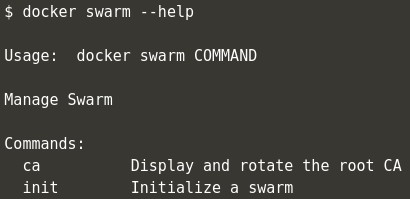

### Step 1 - Initialise Swarm Mode

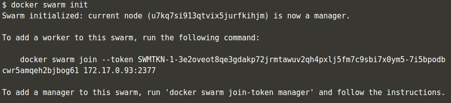

Perintah `docker swarm init` digunakan untuk inisialisi single Docker host menjadi multiple Docker Host (swarm mode). Dengan perintah ini, Docker Engine bisa digunakan untuk clustering dan berlaku sebagai manager, dari perintah ini juga akan menghasilkan sebuah token, yang digunakan untuk menambahkan node ke cluster.

### Step 2 - Join Cluster

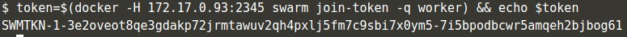

Perintah pada gambar menunjukkan bagaimana cara mendapatkan token dengan menanyakan token kepada manager yang sudah berjalan via `swarm join-token` kemudian menyimpannya pada variable token.


Token yang tersimpan pada variable `$token` bisa digunakan untuk mendaftarkan host yang baru sebagai worker. Secara default manager akan menerima node baru yang ditambahkan ke dalam cluster.

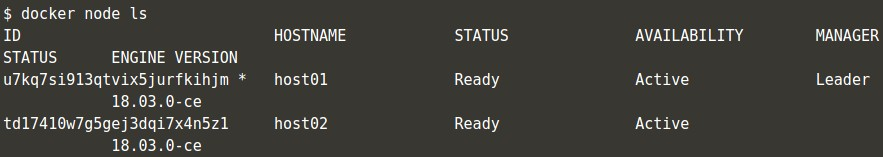

`docker node ls` perintah ini akan menampilkan semua node yang ada didalam cluster.

### Step 3 - Create Overlay Network

Pada swarm mode juga mengenalkan peningkatan pada model jaringan. Pada versi sebelumnya, docker membutuhkan penyimpanan key-value untuk memastikan konsistensi koneksi antar jaringan. Pada docker swarm mode menggunakan network overlay yang memungkinkan containers pada host yang lain untuk saling berkomunikasi, menggunakan Virtual Extensible LAN (VXLAN) yang didesain untuk cloud skala besar.

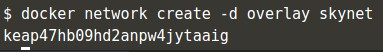

Perintah diatas akan membuat overlay network bernama `skynet`. Semua container yang terhubung ke dalam jaringan ini, akan dapat saling berkomunikasi.

### Step 4 - Deploy Service

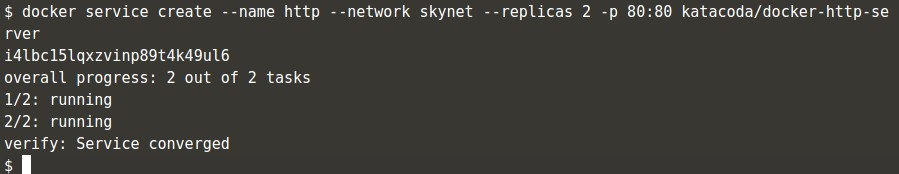

Contoh penggunaan network untuk service http menggunakan Docker Image `katacoda/docker-http-server` dan di replica sebanyak 2 service, kemudian di buat load balance untuk kedua service yang berjalan bersamaan pada port 80. Dengan cara ini node yang menerima request bukan node yang merespon, tapi `docker load balances` melakukan requst ke semua container yang tersedia di dalam cluster.

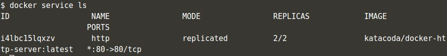

Untuk melihat semua docker service yang berjalan, gunakan perintah `docker service ls`.

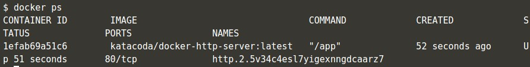

Perintah di atas untuk menampilkan container pada host.


Untuk melihat docker service mana yang merespon request uji dengan perintah `curl` seperti diatas. Terdapat container id service yang merespon request.

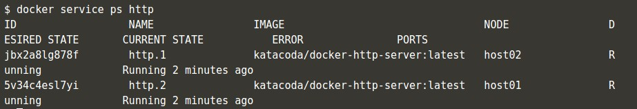

Untuk memastikan container ID, bisa menggunakan perintah `docker service ps http`.

### Step 5 - Inspect State

Menggunakan service memungkinkan kita untuk memeriksa cluster dan aplikasi yang berjalan.

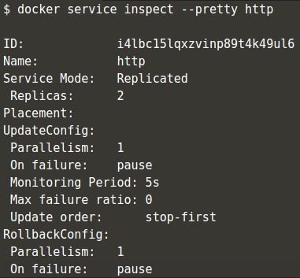

Dari perintah diatas terlihat respon dari service http.


Pada setiap node, kita bisa melihat task apa yang sedang berjalan, dengan perintah seperti gambar diatas. Dari perintah ini kita bisa mendapatkan informasi status node saat ini dan status node yang seharusnya (desired state). Jika status saat itu tidak sesuai yang diharapkan, field error akan terisi jenis errornya.


Jika tidak disertakan nama service, docker akan menampilkan semua service yang berjalan pada cluster.

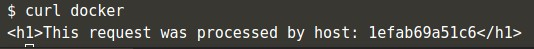

Jika kita jalankan perintah `curl` lagi, bisa kita lihat Service ID yang merespon request berbeda dengan yang pertama. Hal ini dikarenakan dengan sistem load balancing ini service akan mengirimkan request ke semua container yang berjalan pada cluster.

### Step 6 - Scale Service

Sebuah service mengijinkan untuk scale up beberapa instance dari task yang berjalan pada cluster.

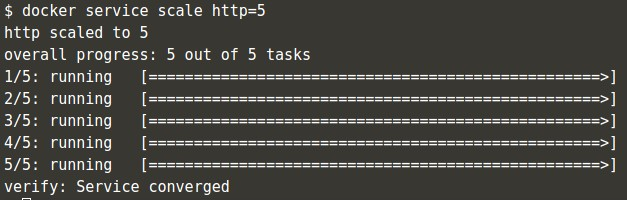

Perintah di atas akan membuat http service berjalan sebanyak 5 containers.

Pada setiap host akan terlihat node tambahan, cek menggunakan perintah `docker ps`

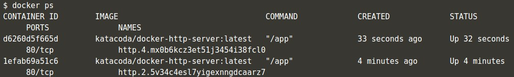

Jika kita jalankan perintah `curl` lagi akan menghasilkan host ID yang berbeda dengan yang awal kita jalankan.

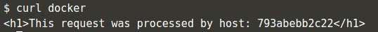
