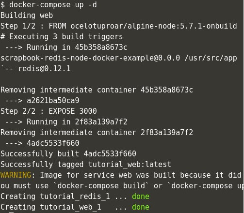
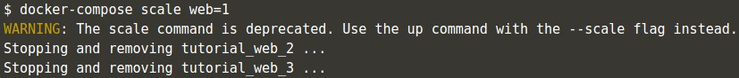

# Pertemuan Minggu-04

## Docker - Orkestrasi menggunakan docker-compose

Saat berkeja dengan multiple containers, bisa jadi sulit untuk mengelola container beserta konfigurasi dan links antar container yang berjalan bersamaan. Untuk mengatasi masalah ini, docker mempunyai tools bernama [docker-compose](https://docs.docker.com/compose/install/).

### Step 1 - Defining First Container

Untuk menjalankan docker-compose yang perlu dilakukan adalah membuat sebuah file `docker-compose.yml` yang berisi tentang docker container dan semua setting yang diperlukan untuk menjalankan docker container.

Format `docker-compose.yml` adalah seperti berikut:

```yaml
container_name:
  property: value
    - or options
```


`docker-compose.yml` ini akan membuat sebuah container dengan nama `web` dan akan membuild content yang ada di folder yang aktif saat docker-compose dijalankan.

### Step 2 - Defining Settings

Docker-compose support semua properties yang digunakan ketika perintah `docker run` dijalankan.

```yaml
web:
  build: .
  links:
    - redis
  ports:
    - "3001"
```

Dari struktur file diatas, `docker-compose` akan membuat link ke container `redis` dan akan me-expose port `3001` sama halnya ketika menggunakan perintah `docker run -p ports --link redis`.

### Step 3 - Defining Second Container

```yaml
web:
  build: .
  links:
    - redis
  ports:
    - "3001"
redis:
  image: redis:alpine
  volumes:
    - /var/redis/data:/data
```

Untuk membuat container yang lain, cukup tambahkan struktur yang sama pada 1 file `docker-compose.yml`. Di dalam step ini, docker-compose akan membuat 2 buah service yaitu `web` dan `redis`.

### Step 4 - Docker Up

Dengan file `docker-compose.yml` yang sudah dibuat, kita bisa menjalankan service-service yang sudah didefinisikan hanya dengan satu baris perintah `docker-compose up -d`. Dengan menyertakan opsi `-d` pada perintah ini, aplikasi (container) akan berjalan di background setelah aplikasi (container) selesai di build.



### Step 5 - Docker Management

Docker compose selain digunakan untuk menjalankan beberapa container dengan satu perintah, docker compose juga bisa digunakan untuk me-manage service (aplikasi) yang di jalankan menggunakan docker compose.


Perintah `docker-compose ps` digunakan untuk melihat proses yang berjalan.


Perintah `docker-compose logs` digunakan untuk melihat log dari aplikasi yang di jalankan menggunakan docker-compose.

Untuk melihat semua perintah yang bisa digunakan docker compose, jalankan perintah `docker-compose`.


Perintah `docker-compose` tanpa diikuti opsi akan menampilkan daftar perintah (help) dari docker compose.

### Step 6 - Docker Scale

Selain digunakan untuk menjalankan beberapa container secara bersamaan docker-compose juga bisa digunakan untuk mengatur jumlah container yang akan dijalankan.


Docker compose dengan menyertakan option scale, bisa mendefinisikan service mana yang akan di scale. Jika service yang sudah berjalan jumlahnya lebih sedikit dari jumlah yang di tentukan maka docker-compose akan menambah.



Jika jumlah scale yang diinginkan lebih sedikit dari jumlah service yang berjalan, service akan di hapus.

### Step 7 - Docker Stop

Untuk menghentikan service yang dijalankan menggunakan docker-compose. Gunakan perintah `docker-compose stop` pada directory dimana file `docker-compose.yml` berada.


Sedangkan untuk menghapus semua container gunakan perintah `docker-compose rm`


## Docker - Orkestrasi menggunakan `swarm mode`
