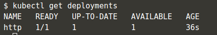
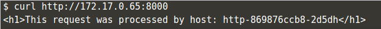
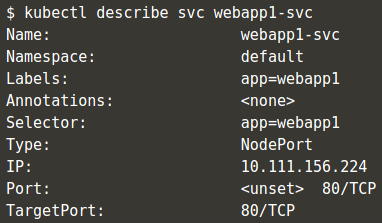

# Pertemuan Minggu-07

## IRIS Go-Framework

## Kubernetes

> Start containers dengan Kubectl

Jalankan perintah `minikube start` untuk download cli kuberctl dan start komponen dari cluster

Jalankan perintah `kubectl get nodes` untuk melihat status dari node yang sudah dijalankan.

Untuk menjalankan container berdasarkan docker image, bisa menggunakan perintah `kubectl run <name of deployment> <properties>
`

> Keterangan gambar, kubectl menjalankan sebuah container bernama http berdasarkan docker image `katacoda/docker-http-server:latest` sebanyak 1 replica.

Untuk mendapatkan status dari proses deployment dari kubectl, gunakan perintah  `kubectl get deployments`, perintah ini akan menghasilkan output pada terminal seperti pada gambar dibawah ini:

sedangkan untuk mendapat status deployement spesifik berdasarkan nama:

perintah ini akan menghasilkan output yang lebih detail dari container yang di maksud, seperti yang terlihat pada gambar, terdapat informasi berapa replika yang berjalan, label, event yang berhubungan dengan container yang dijalankan.

Setelah deployment selesai dibuat, untuk meng-ekspose service ke sebuah port sehingga bisa di akses gunakan perintah `kubectl expose`.

> Keterangan gambar, menggunakan perintah `kubectl expose` untuk meng-ekspose port dari service yaitu 80 ke mesin dengan port 80, sehingga service http bisa di akses melalui port 8080.

Gunakan perintah `curl http://172.17.0.18:8000` untuk test service yang berjalan.

### Kubectl menjalankan service dan langsung expose port dalam satu waktu

Untuk mempersingkat perintah `kubectl` seperti yang ada digambar diatas bisa digunakan untuk menjalankan sebuah service dan langsung meng-ekspos port dari service yang di maksud. Dari gambar diatas bisa di lihat kubectl menjalankan service httpexposed berdasarkan docker image `katacoda/docker-http-server:latest` sebanyak 1 replica dengan mengekspose port 80 ke port 8081.

Jika ditest menggunakan perintah curl, akan menghasilkan output seperti pada gambar diatas.

Dengan perintah ini, service tidak akan muncul ketika dilihat dari perintah `kubectl get svc`. Untuk melihat service gunakan perintah: `docker ps | grep httpexposed` sehingga akan tampil seperti pada gambar dibawah ini.

### Scaling container dengan kubernetes

Setelah service berjalan, dengan kubernetes bisa dengna mudah menambah service ke dalam pods.

Perintah diatas akan menambah 3 replika deployment http ke dalam pods. Ketika menjalankan perintah `kubectl get pods` bisa dilihat berapa banyak http deployment yang berjalan.

Setelah setiap Pod berjalan, akan otomatis ditambah ke dalam load balancer. Dengan menjalan perintah `kubectl describe svc http` akan muncul deskripsi tentang pods beserta end point dan Pod yang saling terkait dengan service http.

Test menggunakan perintah `curl`

## Deploy Container dengan File YAML

Salah satu hal yang paling umum dari kubernetes adalah object deploymentnya. Untuk menjalankan sebuah container menggunakan kubernetes, objek-objek yang diinginkan bisa disimpan dalam sebuah file `yaml`. Buat sebuah file dengan nama `deployment.yaml` dan isi dengan:

Kemudian deploye menggunakan perintah kubectl:

Dengan perintah ini kubectl akan mendeploy container webapp1 sesuai dengan yang terdefinisikan di dalam file `deployment.yaml`. untuk memastikan deployemnt berjalan, jalankan perintah seperti pada gambar dibawah ini.

Dan untuk melihat detail infomasi dari deployment yang dibuat:

Dengan perintah diatas akan menampilkan informasi lengkap terkait deployment yang dibuat menggunakan perintah kubectl.

### Kubernetes Service

Kubernetes mempunyai kemampuan yang ampuh untuk mengontrol bagaiman aplikasi saling berkomunikasi. Konfigurasi jaringan ini dalam kubernetes juga bisa di kontrol dalam sebuah file `yaml`. Buat sebuah file `service.yaml`

Service akan mencari semua service denga label `webapp1` dan akan membuat aplikasi tersedia melalui `NodePort`. Deploy service dengan perintah:

Sama seperti sebelumnya, lihat informasi tentang service dengan perintah `kubectl get svc`

Untuk melihat informasi detail tentang service, jalankan perintah seperti pada gambar dibawah.

Pastikan service bisa di akses dengan perintah curl dari mesin.

### Meningkatkan deployment

Detail tentang file `yaml` bisa berubah setiap saat, tergantung dari kebutuhan development sebuah app. Contoh, untuk menambahkan service yang berjalan, update file `deployment.yaml` dan updata pada bagian `replicas:` menjadi `replicas: 4`. Setelah selesai dengan update file, apply perubahan.

Pastikan perubahan sukses di aplikasikan:

Karena semua pods mempunyai label yang sama, Pods akan di load balancing melalui NodePort. Ketika di test menggunakan `curl` akan menghasilkan output yang berbeda tergantung service mana yang dapat merespond request dari client:

