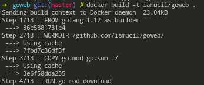
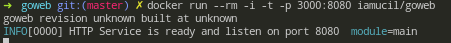
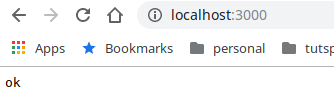
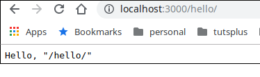
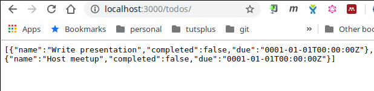
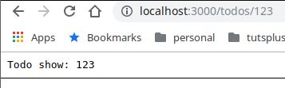
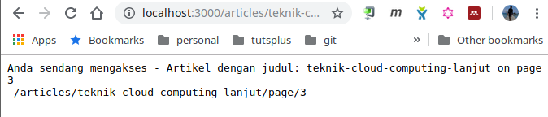
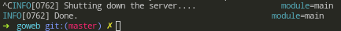

# `goweb` - Menggunakan golang HTTP Server

Struktur folder goweb

```bash
├── Dockerfile
├── go.mod
├── go.sum
├── handlers.go
├── main.go
├── README.md
└── resources
    └── assets
        └── index.html
```

`goweb` ini merupakan contoh development menggunakan bahasa pemrograman go.

`Dockerfile` : Merupakan file docker dalam format yaml, yang digunakan untuk nge-build dan menjalankan `goweb` di dalam environment docker (container). Di dalam file ini terdapat instruksi-intrusi untuk menjalankan `goweb`. Menggunakan multi-stage build, untuk membuat hasil final dari `goweb` lebih simple. `Dockerfile` di sini menggunakan 2 base image yaitu `golang:.12` sebagai builder, dan `alpine` untuk menjalankan service dari `goweb`.

`go.mod` & `go.sum` : Merupakan file yang digunakan untuk menampung daftar package yang digunakan oleh `goweb` dalam development ini menggunakan [`go modules`](https://github.com/golang/go/wiki/Modules). Dengan `go modules` memungkin aplikasi yang di bangun dengan golang tidak perlu di tempatkan di folder `GOPATH`.

`main.go` : Merupakan file utama dari `goweb`, file ini merupakan entrypoint dari `goweb`. Sedangkan `handlers.go` merupakan kumpulan dari handler yang berisi code untuk router web.

`resources` : Direktori untuk menampung file statis dari go web, ketika dijalankan akan di akses melalui url `/assets`

## Go Package

Untuk menjalankan `goweb` ini ada 2 package utama yang digunakan, yaitu:

1. `net/http`

  Package ini berisi semua utilitas yang dibutuhkan untuk menerima http request dan bagaimana menhandle dan menghasilkan respon dari user request.

2. `github.com/gorilla/mux`

  `gorilla/mux` adalah package yang mengadopsi default `http router`. Package ini memiliki fitur yang lebih lengkap, dan sangat membantu untuk membuat aplikasi web. Install package dengan menjalankan perintah.

  ```bash
  go get -u all && go mod tidy
  ```

  Perintah ini akan mencari package apa saja yang di import di dalam aplikasi, dan akan menambahkan daftar package secara otomatis di dalam file `go.mod` dan `go.sum`.

## `main.go`


Definisinikan nama package dengan `main` kemudian import package-package yang dibutuhkan untuk membuat web aplikasi `goweb`.

```go
routerHandler := mux.NewRouter()

httpServicePort := os.Getenv("HTTP_PORT")
if httpServicePort == "" {
  httpServicePort = "8080"
}
```

Inisiasi router `gorila/mux` dan definisikan http port yang akan digunakan oleh http server, jika tidak ditemukan os environment dengan nama `HTTP_PORT` maka port default dari web ini adalah `8080`.

### Definisikan Router

```go
routerHandler.HandleFunc("/", Index)
routerHandler.PathPrefix("/assets/").Handler(http.StripPrefix("/assets/", http.FileServer(http.Dir("resources/assets"))))
routerHandler.HandleFunc("/articles/{title}/page/{page}", Article).Methods("GET")
routerHandler.HandleFunc("/todos/", TodoIndex).Methods("GET")
routerHandler.HandleFunc("/todos/{todo-id}", TodoShow).Methods("GET")
routerHandler.HandleFunc("/hello/", Hello).Methods("GET")
```

`/` adalah root path ketika aplikasi web ini dijalankan, dan akan memanggil fungsi `Index` pada file `handlers.go`.
`/assets/` ketika url ini di akses akan menampilkan file `index.html` yang ada di folder `resources/assets`, hal ini karena menggunakan fungsi `http.FileServer`, yaitu fungsi untuk mengambil semua file statis yang ada di dalam direktori.
`/articles/{title}/page/{page}` contoh routing untuk memanggil uri dengan menyertakan parameter di dalam path uri nya. Router ini akan memanggil handler `Article` yang ada di file `handlers.go`.

```go
func Article(resp http.ResponseWriter,req *http.Request)  {
  vars := mux.Vars(req)
  title := vars["title"]
  page := vars["page"]

	fmt.Fprintf(resp, "Anda sendang mengakses - Artikel dengan judul: %s on page %s\n %s", title, page, html.EscapeString(req.URL.Path))

}
```

`var := mux.Vars(req)` code ini merupakan fungsi dari package `gorilla/mux` untuk menangkap variable yang di sertakan di dalam path parameter ketika routing di akses. Path parameter yang di ambil seperti yang ada di dalam code, adalah `title` dan `page`. Untuk Route `/todos/`, `/todos/{todo-id}`, `/hello` adalah contoh lain implementasi penggunakan Routing dengan memanfaatkan package `gorilla/mux`. Routing yang ada di dalam aplikasi ini di definisikan menggunakan method `GET`, untuk menggunakan method selain `GET` bisa di definisikan dengan fungsi `.method("NAMA_METHOD")`, Contoh lain adalah `POST`, `PUT`, `DELETE`, `PATCH`. Setiap method memiliki fungsi masing-masing di dalam aplikasi web.

```go
var shuttingDown bool
shutdownSignal := make(chan os.Signal)
signal.Notify(shutdownSignal, syscall.SIGINT, syscall.SIGTERM)
```

Potongan code diatas, digunakan untuk menangkap signal dari sistem dan SIGINT (ctrl + c).

```go
httpServer := &http.Server{
  Addr: ":" + httpServicePort,
  Handler: routerHandler,
}

go func() {
  log.Infof("HTTP Service is ready and listen on port %s", httpServicePort)
  err := httpServer.ListenAndServe()

  if err != nil && (err != http.ErrServerClosed || !shuttingDown) {
    log.Errorf("HTTP Service error: %v", err)
  }
}()
```

Code di atas digunakan untuk inisiasi http server, inisiasi port dan router mux, dan http server di jalankan di dalam goroutine.

```go
<-shutdownSignal
shuttingDown = true
log.Infof("Shutting down the server....")

go func() {
  <-shutdownSignal
  os.Exit(0)
}()

shutdownCtx, _ := context.WithTimeout(context.Background(), 15*time.Second)

httpServer.Shutdown(shutdownCtx)
```

Selain itu, code diatas digunakan untuk menangkap proses shutdown (ctrl + c), jika di temukan signal (CTRL + C) otomatis aplikasi web akan mematikan httpserver.

## Build image

Untuk menjalankan aplikasi web `goweb` ini yang perlu dilakukan adalah build docker image dengan perintah `docker build -t nama_image .`



Perintah ini digunakan untuk build docker image berdasarkan step-step yang sudah ditentukan di dalam file `Dockerfile`, sehingga aplikasi bisa di jalankan. Untuk menjalankan aplikasi gunakan perintah `docker run --rm -i -t -p 3000:8080 nama_image:tag`, perintah ini akan menjalankan docker image di dalam container dan akan melakukan bind port 8080 milik container ke port 3000 milik mesin local, dan aplikasi bisa di akses melalui uri `localhost:3000`.



Akses aplikasi melalui browser > `localhost:3000`.







## Graceful shutdown dari sigint


