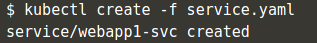
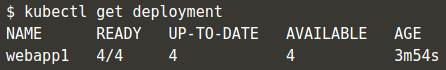
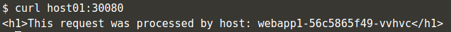

# Deploy Containers menggunankan file `YAML`

Salah satu hal yang paling umum dari kubernetes adalah object deploymentnya. Untuk menjalankan sebuah container menggunakan kubernetes, objek-objek yang diinginkan bisa disimpan dalam sebuah file `yaml`. Buat sebuah file dengan nama `deployment.yaml` dan isi dengan:

Kemudian deploye menggunakan perintah kubectl:

Dengan perintah ini kubectl akan mendeploy container webapp1 sesuai dengan yang terdefinisikan di dalam file `deployment.yaml`. untuk memastikan deployemnt berjalan, jalankan perintah seperti pada gambar dibawah ini.

Dan untuk melihat detail infomasi dari deployment yang dibuat:

Dengan perintah diatas akan menampilkan informasi lengkap terkait deployment yang dibuat menggunakan perintah kubectl.

## Kubernetes Service

Kubernetes mempunyai kemampuan yang ampuh untuk mengontrol bagaiman aplikasi saling berkomunikasi. Konfigurasi jaringan ini dalam kubernetes juga bisa di kontrol dalam sebuah file `yaml`. Buat sebuah file `service.yaml`

Service akan mencari semua service denga label `webapp1` dan akan membuat aplikasi tersedia melalui `NodePort`. Deploy service dengan perintah:

Sama seperti sebelumnya, lihat informasi tentang service dengan perintah `kubectl get svc`

Untuk melihat informasi detail tentang service, jalankan perintah seperti pada gambar dibawah.

Pastikan service bisa di akses dengan perintah curl dari mesin.

## Meningkatkan deployment

Detail tentang file `yaml` bisa berubah setiap saat, tergantung dari kebutuhan development sebuah app. Contoh, untuk menambahkan service yang berjalan, update file `deployment.yaml` dan updata pada bagian `replicas:` menjadi `replicas: 4`. Setelah selesai dengan update file, apply perubahan.

Pastikan perubahan sukses di aplikasikan:

Karena semua pods mempunyai label yang sama, Pods akan di load balancing melalui NodePort. Ketika di test menggunakan `curl` akan menghasilkan output yang berbeda tergantung service mana yang dapat merespond request dari client:

